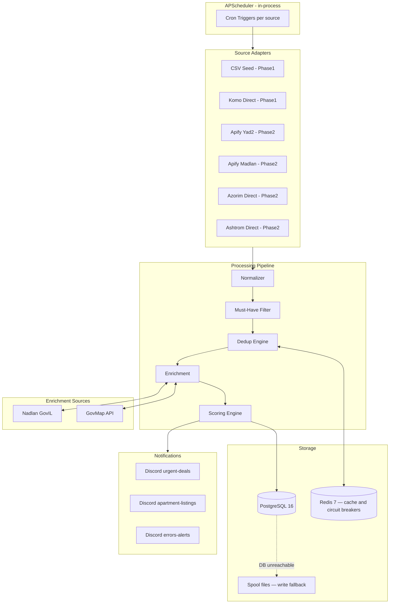

# Real-Estate Watchdog — Full Technical Specification

## 1. Clarified Product Goal

Build a containerized, generic real-estate monitoring bot that:
- Polls multiple listing sources on a configurable schedule
- Normalizes, deduplicates, filters, enriches, and scores listings
- Sends structured Discord notifications for new/changed listings above configurable thresholds
- Persists all data to PostgreSQL with an event log and single-snapshot history
- Is fully driven by YAML config — no code changes needed to repurpose for a different search

Default configuration: your apartment-search requirements (rent, 4–5 rooms, 8k NIS budget, 8 cities, mamad/elevator/outdoor mandatory, new building preferred).

---

## 2. Assumptions

- Direct scraping of Yad2/Madlan from your server returns 403 → must use an external collection service (Apify) for these two sources; **Apify is explicitly deferred to Phase 2 (Milestone 4+) — Phase 1 validates the pipeline with zero cost**
- Komo, Azorim, Ashtrom are reachable → direct HTTP scraping is possible; Komo is used as the first live Phase 1 adapter
- Nadlan.gov.il and GovMap are reachable → can be used for building-age enrichment
- Docker images pull successfully → deployment is via Docker Compose on RHEL 9.6
- PyPI may be blocked during `docker build` on the host VPN → a `docker save` / `docker load` transfer workflow is the defined fallback (see Section 21)
- Discord webhooks are reachable → use webhooks (not gateway bot) for notifications
- npm registry may be blocked from the host → use Python exclusively to avoid this constraint
- pip3 is not installed on the host, but Python dependencies will be installed inside Docker images
- Ollama (gemma3:4b) is available locally → reserved for future image analysis, not used in MVP
- Apify free tier ($5/month credit) is sufficient for conservative initial polling rates once activated
- No hard real-time requirement → 30–60 minute polling intervals are acceptable
- The entire application is **fully asynchronous**: asyncio event loop, async HTTP clients, asyncpg for PostgreSQL — no sync blocking calls in the hot path

---

## 3. Non-Goals for MVP

- No web dashboard or admin UI
- No image downloading or local image storage (URLs only)
- No image analysis / perceptual hashing
- No Facebook / WhatsApp / Telegram scraping
- No Celery or distributed task queue
- No authentication or multi-user support
- No dynamic config changes at runtime
- No email notifications
- No automatic deduplication resolution (flagged for manual review)
- No business license or rental contract clause analysis
- No Megureit scraper (returned 403)
- No Africa Israel / AFI scraper (timed out)
- No Homeless scraper (Cloudflare-protected)

---

## 4. Recommended Architecture



The entire application runs as a **single Python process** on a **fully async event loop** (`asyncio.run(main())`). All I/O — HTTP requests, DB queries, Redis calls — is non-blocking. APScheduler v3 fires async jobs as `asyncio.Task` instances; multiple sources run concurrently without threads. Redis is a sidecar for dedup cache, enrichment cache, and circuit-breaker counters. PostgreSQL persists all data via asyncpg. Discord webhooks deliver notifications. In Phase 1, only the CSV seed adapter and Komo are active; Apify adapters are disabled until the Decision Gate passes.

---

## 5. Alternative Architecture Options

| Option | When to prefer it |
|---|---|
| Celery + Redis broker instead of APScheduler | If you need >20 concurrent scraping tasks or distributed workers |
| Node.js/TypeScript | If npm registry becomes accessible; would have a richer scraping ecosystem but adds complexity given current constraints |
| Separate microservices per adapter | If adapters become complex enough to warrant independent deployments; unnecessary for MVP scale |
| Apify webhooks instead of polling Apify results | Simpler if Apify actor runs complete reliably; currently, polling is safer and easier to debug |

---

## 6. Recommended Tech Stack with Justifications

The entire stack is **fully asynchronous**. Every I/O operation (HTTP requests, DB queries, Redis calls) runs on Python's asyncio event loop. There are no sync blocking calls in the hot path. This maximizes throughput when multiple sources are polled concurrently and keeps the single-process architecture viable at scale.

| Layer | Choice | Justification |
|---|---|---|
| Language | **Python 3.12** | npm SSL issues rule out Node.js from host; Python has excellent scraping/data ecosystem; pip inside Docker works fine; Python 3.12-slim already pullable |
| Async runtime | **asyncio** (stdlib) | Native Python async; all adapters, pipeline stages, and DB calls run on a single event loop; no threading complexity |
| HTTP client | **httpx[asyncio]** (async-first) | Modern async HTTP client with HTTP/2 support; used for direct scrapers and Apify REST API calls; `AsyncClient` reused across requests per source |
| Scheduling | **APScheduler v3.11.x** | v4 is still alpha and explicitly labeled "do not use in production." v3.11.x is stable, has SQLAlchemyJobStore for PostgreSQL, and is sufficient for ~5 sources; async jobs run via `asyncio` executor |
| Config | **dynaconf + pydantic v2** | dynaconf handles layered YAML + env vars + secrets; pydantic provides type-safe schema validation and models |
| Database driver | **asyncpg** | Fastest async PostgreSQL driver; pure asyncio, binary protocol, zero thread overhead; chosen over psycopg3 specifically for the fully async architecture requirement |
| Migrations | **Alembic** | Schema management; migration scripts applied synchronously at startup before the async loop starts |
| Discord | **discord-webhook** library | Lightweight, handles rate limiting, embed support, async-compatible; zero overhead compared to full discord.py |
| Redis client | **redis.asyncio** (part of redis-py v4+) | Async Redis client; same package as redis-py, different import; used for dedup cache, circuit breakers, enrichment cache |
| HTML parsing | **httpx[asyncio] + BeautifulSoup4 + lxml** | For direct-access scrapers (Komo, Azorim, Ashtrom); parsing is CPU-bound and fast enough not to require offloading |
| Apify integration | **apify-client** (official Python SDK) | Clean API wrapper for cloud actor triggering; HTTP calls wrapped in async executor in Phase 2 |
| Logging | **structlog** | Structured JSON logging; async-safe; correlates request IDs and source names across concurrent jobs |
| Retry/backoff | **tenacity** | Declarative async retry decorators (`AsyncRetrying`) with exponential backoff; wraps adapter fetch calls |
| Data validation | **pydantic v2** | Used for config models and normalized listing models |

**Concurrency model**: Each APScheduler job runs its source pipeline as an `asyncio.Task`. Multiple sources run concurrently on the same event loop. The pipeline itself processes listings sequentially within a single source run (one `async for` loop over adapter results), avoiding rate-limit issues while still benefiting from async I/O for each DB write and HTTP enrichment call.

**Fallback for npm accessibility**: If npm ever becomes needed (e.g., for a JS-native scraper), build Docker images on a machine with npm access and push to a local registry or use pre-built images. Not needed for current plan.

---

## 7. Source Adapter Design

All adapters implement a common abstract base and are fully async:

```python
# src/adapters/base.py
from abc import ABC, abstractmethod
from typing import AsyncIterator
from src.core.models import RawListing

class BaseAdapter(ABC):
    name: str

    @abstractmethod
    async def fetch(self, search_config: dict) -> AsyncIterator[RawListing]:
        """Async generator: yields raw listings from this source."""
        ...

    @abstractmethod
    async def health_check(self) -> bool:
        """Returns True if source is reachable."""
        ...
```

Each `fetch()` is an `async def` using `async for` internally, yielding items as they are received. The pipeline calls `async for listing in adapter.fetch(config)` — it does not buffer all results before processing. This means DB writes and enrichment calls begin as soon as the first result arrives.

**Manual CSV Adapter** (`csv_seed.py`) — Phase 1 only:
- Reads a CSV/JSON file from a configured path (e.g., `data/seed/listings.csv`)
- Yields one `RawListing` per row with a configurable delay between rows (to simulate real pacing)
- Purpose: validate the entire pipeline (normalizer → filter → dedup → scoring → DB → Discord) with zero external cost and zero network dependency
- The CSV schema matches the normalized `RawListing` model; seed data can include intentional duplicates and edge cases (no images, no mamad, price above 8500, etc.) to exercise all code paths
- Disabled automatically once `enabled: false` in source config

**Direct scrapers** (`komo.py`, `azorim.py`, `ashtrom.py`):
- Use `httpx.AsyncClient` (shared session per adapter instance) + BeautifulSoup4 to request listing pages
- Parse HTML/JSON response inside the async generator
- Respect per-source rate limits and jitter delays (`await asyncio.sleep(jitter)`)
- Use realistic browser headers and session cookies where needed

**Apify adapters** (`apify_yad2.py`, `apify_madlan.py`) — Phase 2 only:
- Trigger Apify cloud Actor via REST API using `httpx.AsyncClient`
- Poll for run completion asynchronously (poll interval: 10s with exponential backoff)
- Download dataset items from Apify's result storage as a stream
- Transform each item into `RawListing`
- Actor IDs: `swerve/yad2-scraper` ($5/1000 results), `swerve/madlan-scraper` ($2/1000 results)

**Source-specific normalization** happens inside each adapter before returning `RawListing`. The `Normalizer` class then maps `RawListing` → `Listing` (canonical model).

---

## 8. Generic Config Design

Config is read at startup from three YAML files and environment variables. `dynaconf` merges them in priority order: env vars > `.secrets.yaml` > `config/default.yaml`.

The config schema (pydantic model) defines:

- `search.transaction_type`: `rent` | `buy`
- `search.budget.*`: min, preferred, target, soft_max, hard_max
- `search.rooms.*`: min, max, storage_counts_as_half
- `search.cities[]`: list of `{name, neighborhoods[], tags[]}`
- `search.young_neighborhoods[]`: manually tagged young/family neighborhoods
- `search.must_have.*`: boolean flags for each mandatory field
- `search.sources[]`: list of `{name, enabled, adapter, schedule, batch_limit, actor_id?, ...}`
- `enrichment.*`: per-enricher toggles and cache TTL
- `notifications.discord.*`: webhook URLs, thresholds, batch settings
- `scoring.*`: see Section 10
- `persistence.*`: raw payload flag, image URL flag

The **same system** runs a completely different search by replacing `config/default.yaml`. No code changes needed.

---

## 9. Search Config Example

```yaml
# config/default.yaml
search:
  transaction_type: rent

  budget:
    preferred_nis: 7500
    target_nis: 8000
    soft_max_nis: 8500
    hard_max_nis: null      # no hard reject by price

  rooms:
    min: 4
    max: 5.5
    storage_room_counts_as_half: true

  must_have:
    mamad: true
    elevator: true
    images_required: true   # no images → ignore listing
    outdoor_space: true     # at least one of balcony/garden/roof

  parking:
    required: false
    scoring_weight: true

  building:
    prefer_new: true
    max_age_years: 3
    reject_if_unknown: false

  include_agency_listings: true
  include_private_listings: true

  cities:
    - name: Petah Tikva
      neighborhoods: [Em HaMoshavot, Hadar HaMoshavot, Neve Gan, Kfar Ganim]
      tags: [high_supply]
    - name: Or Yehuda
      neighborhoods: [Beit BaPark]
    - name: Givat Shmuel
      tags: [rare_deal_only]
    - name: Givatayim
      tags: [rare_deal_only]
    - name: Ramat Gan
      neighborhoods: [Krinitzi HaHadasha, Ramat Efal, Tel Hashomer]
    - name: Hod HaSharon
      neighborhoods: [Merkaz HaMithadesh, HaGeula]
      tags: [high_quality_population, good_education]
    - name: Tel Aviv
      tags: [rare_deal_only]
    - name: Kiryat Ono
      neighborhoods: [Ono Park, Krinitzi HaHadasha, Psagot Ono]
      tags: [strong_population]

  young_neighborhoods:
    - {city: Petah Tikva, neighborhood: Em HaMoshavot}
    - {city: Petah Tikva, neighborhood: Hadar HaMoshavot}
    - {city: Or Yehuda, neighborhood: Beit BaPark}
    - {city: Kiryat Ono, neighborhood: Ono Park}
    - {city: Hod HaSharon, neighborhood: HaGeula}
    - {city: Ramat Gan, neighborhood: Krinitzi HaHadasha}

  sources:
    # --- Phase 1 sources (no Apify, no cost) ---
    - name: csv_seed
      enabled: false              # set true only for pipeline validation; disabled in production
      adapter: csv_seed
      seed_file: data/seed/listings.csv
      row_delay_seconds: 0.1      # simulate pacing between rows
      schedule: null              # run once manually: make run-source source=csv_seed

    - name: komo
      enabled: true
      adapter: komo
      schedule: "*/30 * * * *"   # every 30 min (direct, fast)
      jitter_seconds: 60
      batch_limit: 15

    # --- Phase 2 sources (add after Decision Gate) ---
    - name: yad2
      enabled: false              # enable after Decision Gate validation
      adapter: apify_yad2
      actor_id: swerve/yad2-scraper
      schedule: "0 */2 * * *"    # every 2 hours (conservative for free tier)
      jitter_seconds: 300
      batch_limit: 15

    - name: madlan
      enabled: false              # enable after Decision Gate validation
      adapter: apify_madlan
      actor_id: swerve/madlan-scraper
      schedule: "30 */2 * * *"   # every 2 hours, offset 30 min from yad2
      jitter_seconds: 300
      batch_limit: 15

    - name: azorim
      enabled: false              # enable after confirming rental listings exist
      adapter: azorim
      schedule: "0 */6 * * *"    # every 6 hours (slow-changing inventory)
      jitter_seconds: 300
      batch_limit: 50

    - name: ashtrom
      enabled: false              # enable after confirming rental listings exist
      adapter: ashtrom
      schedule: "0 */6 * * *"
      jitter_seconds: 300
      batch_limit: 50

enrichment:
  enabled: true
  nadlan_gov_il:
    enabled: true
    cache_ttl_hours: 168            # 1 week

  govmap:
    enabled: true
    cache_ttl_hours: 168

notifications:
  discord:
    enabled: true
    urgent_webhook_url: "${DISCORD_URGENT_WEBHOOK_URL}"
    normal_webhook_url: "${DISCORD_NORMAL_WEBHOOK_URL}"
    error_webhook_url: "${DISCORD_ERROR_WEBHOOK_URL}"
    batch_delay_seconds: 300        # batch normal notifications
    max_images_in_embed: 3

  notify_on_events:
    - first_seen
    - price_dropped
    - images_added
    - returned_to_market
    - enrichment_updated_score

persistence:
  save_raw_payload: true
  store_image_urls: true
  download_images: false
```

---

## 10. Scoring Config Example

```yaml
# config/scoring.yaml
scoring:
  price:
    baseline_nis: 8000
    penalty_per_50_above_baseline: 1
    # Exact formula: price_penalty = -floor((price - baseline_nis) / 50)
    # Applied only when price > baseline_nis. Examples:
    #   8,050 NIS → floor(50/50)  = 1 → penalty -1
    #   8,100 NIS → floor(100/50) = 2 → penalty -2
    #   8,300 NIS → floor(300/50) = 6 → penalty -6
    #   8,500 NIS → floor(500/50) = 10 → penalty -10
    soft_reject_above_nis: 8500
    hard_reject_above_nis: null

  rooms:
    # effective_rooms = rooms + (0.5 if has_storage else 0)
    # Exact rule: a 4-room apartment WITHOUT a storage room receives exactly 0 points.
    # It is not penalized, but receives no bonus. It can still be notified if other
    # scores are high enough. Only a combined score below the notification threshold
    # will suppress it.
    by_effective_rooms:
      4.0: 0          # 4 rooms, no storage: 0 points — not penalized, not rewarded
      4.5: 20         # 4 rooms + storage room, or native 4.5 rooms
      5.0: 20         # 5 rooms (equivalent value to 4.5 for this search)
      5.5: 15         # larger than needed — slight downgrade
    below_4_score: -20
    above_5_5_score: 10

  amenities:
    mamad: 10
    elevator: 10
    parking: 10
    balcony: 10
    garden: 10
    roof: 10
    long_term_rental: 10

  building_age:
    new_threshold_years: 3
    score_new_verified: 20
    score_new_estimated: 12
    score_unknown: 0
    score_old_verified: -5

  neighborhood:
    young_family_oriented: 10

  must_have:
    # Fail-fast: if any missing, listing is discarded before scoring
    - mamad
    - elevator
    - has_images
    - outdoor_space

  notification:
    urgent_score_threshold: 60
    normal_score_threshold: 30
```

**Scoring engine — exact price penalty implementation:**

```python
def compute_price_penalty(price: int, config: ScoringConfig) -> int:
    """
    Deducts exactly 1 point for every 50 NIS above the baseline.
    Uses integer floor division. No penalty below or at baseline.
    """
    if price <= config.price.baseline_nis:
        return 0
    excess = price - config.price.baseline_nis
    return -(excess // 50)
```

**Scoring engine — exact room score implementation:**

```python
def compute_room_score(rooms: float, has_storage: bool, config: ScoringConfig) -> int:
    """
    effective_rooms = rooms + 0.5 if has_storage else rooms.
    A 4-room apartment without storage receives exactly 0 points (by_effective_rooms key 4.0).
    """
    effective = rooms + (0.5 if has_storage else 0.0)
    # Round to nearest 0.5 to match config keys
    key = round(effective * 2) / 2
    return config.rooms.by_effective_rooms.get(key, config.rooms.below_4_score)
```

**Score breakdown** is stored as JSON in `listings.score_breakdown`:
```json
{
  "price_penalty": -6,
  "rooms_bonus": 20,
  "mamad": 10,
  "elevator": 10,
  "parking": 10,
  "balcony": 10,
  "building_age_estimated": 12,
  "young_neighborhood": 10,
  "total": 76,
  "must_have_passed": true,
  "reject_reason": null
}
```

---

## 11. Database Schema

```sql
-- migrations/001_initial.sql

CREATE EXTENSION IF NOT EXISTS "pgcrypto";

CREATE TABLE listings (
    id                      UUID PRIMARY KEY DEFAULT gen_random_uuid(),
    canonical_id            VARCHAR(64) NOT NULL UNIQUE,

    -- Source
    source_name             VARCHAR(64) NOT NULL,
    source_id               VARCHAR(256),
    source_url              TEXT,

    -- Content
    title                   TEXT,
    description             TEXT,

    -- Location
    city                    VARCHAR(128),
    neighborhood            VARCHAR(128),
    street                  VARCHAR(256),
    street_number           VARCHAR(32),

    -- Physical
    floor                   INTEGER,
    total_floors            INTEGER,
    rooms                   DECIMAL(4,1),
    has_storage             BOOLEAN,
    -- Computed: effective_rooms for scoring
    effective_rooms         DECIMAL(4,1) GENERATED ALWAYS AS (
        CASE WHEN has_storage = TRUE THEN rooms + 0.5 ELSE rooms END
    ) STORED,
    area_sqm                INTEGER,

    -- Price
    price                   INTEGER NOT NULL,
    price_currency          CHAR(3) DEFAULT 'ILS',

    -- Amenities
    has_mamad               BOOLEAN,
    has_elevator            BOOLEAN,
    has_parking             BOOLEAN,
    parking_type            VARCHAR(64),
    has_balcony             BOOLEAN,
    has_garden              BOOLEAN,
    has_roof                BOOLEAN,
    is_long_term            BOOLEAN,

    -- Images
    image_urls              JSONB DEFAULT '[]',
    image_count             INTEGER DEFAULT 0,

    -- Contact (stored, never logged/sent to Discord)
    contact_phone_raw       TEXT,
    contact_phone_hash      VARCHAR(64),

    is_agency               BOOLEAN,
    raw_payload             JSONB,

    -- Scoring
    score                   INTEGER,
    score_breakdown         JSONB,

    -- Status
    status                  VARCHAR(16) DEFAULT 'active'
                            CHECK (status IN ('active', 'removed', 'stale')),

    -- Building enrichment
    building_year_built     INTEGER,
    building_age_estimate   INTEGER,
    building_age_confidence VARCHAR(16) DEFAULT 'unknown'
                            CHECK (building_age_confidence IN
                                   ('unknown', 'estimated', 'verified')),
    enrichment_data         JSONB DEFAULT '{}',

    -- Timestamps
    first_seen_at           TIMESTAMPTZ NOT NULL DEFAULT NOW(),
    last_seen_at            TIMESTAMPTZ NOT NULL DEFAULT NOW(),
    last_updated_at         TIMESTAMPTZ,
    notified_at             TIMESTAMPTZ,
    created_at              TIMESTAMPTZ NOT NULL DEFAULT NOW(),
    updated_at              TIMESTAMPTZ NOT NULL DEFAULT NOW()
);

CREATE INDEX idx_listings_status_score  ON listings(score DESC) WHERE status = 'active';
CREATE INDEX idx_listings_city          ON listings(city);
CREATE INDEX idx_listings_source        ON listings(source_name, source_id);
CREATE INDEX idx_listings_first_seen    ON listings(first_seen_at DESC);
CREATE INDEX idx_listings_price         ON listings(price) WHERE status = 'active';
CREATE INDEX idx_listings_phone_hash    ON listings(contact_phone_hash)
                                        WHERE contact_phone_hash IS NOT NULL;

-- One previous snapshot per listing (UNIQUE enforced)
CREATE TABLE listing_snapshots (
    id              UUID PRIMARY KEY DEFAULT gen_random_uuid(),
    listing_id      UUID NOT NULL REFERENCES listings(id) ON DELETE CASCADE,
    price           INTEGER,
    image_count     INTEGER,
    image_urls      JSONB,
    score           INTEGER,
    score_breakdown JSONB,
    has_mamad       BOOLEAN,
    has_elevator    BOOLEAN,
    has_parking     BOOLEAN,
    has_balcony     BOOLEAN,
    has_garden      BOOLEAN,
    has_roof        BOOLEAN,
    status          VARCHAR(16),
    snapshotted_at  TIMESTAMPTZ NOT NULL DEFAULT NOW(),
    UNIQUE(listing_id)
);

-- Event log
CREATE TABLE listing_events (
    id           UUID PRIMARY KEY DEFAULT gen_random_uuid(),
    listing_id   UUID NOT NULL REFERENCES listings(id) ON DELETE CASCADE,
    event_type   VARCHAR(64) NOT NULL,
    -- event_type values:
    -- first_seen | updated | price_dropped | price_increased |
    -- images_added | returned_to_market | removed |
    -- notified | source_failed | enrichment_updated_score
    old_value    JSONB,
    new_value    JSONB,
    source_name  VARCHAR(64),
    occurred_at  TIMESTAMPTZ NOT NULL DEFAULT NOW()
);

CREATE INDEX idx_events_listing_id ON listing_events(listing_id);
CREATE INDEX idx_events_type       ON listing_events(event_type);
CREATE INDEX idx_events_occurred   ON listing_events(occurred_at DESC);

-- Source run tracking (circuit breaker input, ops visibility)
CREATE TABLE source_runs (
    id               UUID PRIMARY KEY DEFAULT gen_random_uuid(),
    source_name      VARCHAR(64) NOT NULL,
    started_at       TIMESTAMPTZ NOT NULL DEFAULT NOW(),
    completed_at     TIMESTAMPTZ,
    status           VARCHAR(16) DEFAULT 'running'
                     CHECK (status IN ('running', 'success', 'failed', 'partial')),
    listings_fetched INTEGER DEFAULT 0,
    listings_new     INTEGER DEFAULT 0,
    listings_updated INTEGER DEFAULT 0,
    error_message    TEXT,
    apify_run_id     VARCHAR(256)
);

CREATE INDEX idx_source_runs_name    ON source_runs(source_name);
CREATE INDEX idx_source_runs_started ON source_runs(started_at DESC);

-- Cross-source dedup link table
CREATE TABLE dedup_matches (
    id           UUID PRIMARY KEY DEFAULT gen_random_uuid(),
    listing_id_a UUID NOT NULL REFERENCES listings(id),
    listing_id_b UUID NOT NULL REFERENCES listings(id),
    confidence   VARCHAR(16) CHECK (confidence IN ('exact','high','medium','low')),
    match_reason TEXT,
    resolved_at  TIMESTAMPTZ,
    resolution   VARCHAR(16) CHECK (resolution IN ('same','different','pending')),
    created_at   TIMESTAMPTZ NOT NULL DEFAULT NOW(),
    UNIQUE(listing_id_a, listing_id_b)
);

-- Notification queue (for batching normal-priority notifications)
CREATE TABLE notification_queue (
    id         UUID PRIMARY KEY DEFAULT gen_random_uuid(),
    listing_id UUID NOT NULL REFERENCES listings(id),
    event_type VARCHAR(64) NOT NULL,
    channel    VARCHAR(16) NOT NULL CHECK (channel IN ('urgent','normal','error')),
    payload    JSONB NOT NULL,
    queued_at  TIMESTAMPTZ NOT NULL DEFAULT NOW(),
    sent_at    TIMESTAMPTZ,
    status     VARCHAR(16) DEFAULT 'pending'
               CHECK (status IN ('pending','sent','failed'))
);

CREATE INDEX idx_notif_pending ON notification_queue(queued_at) WHERE status = 'pending';

-- Enrichment result cache (avoid re-querying gov sources for same address)
CREATE TABLE enrichment_cache (
    id         UUID PRIMARY KEY DEFAULT gen_random_uuid(),
    cache_key  VARCHAR(256) NOT NULL UNIQUE,
    source     VARCHAR(64) NOT NULL,
    result     JSONB NOT NULL,
    cached_at  TIMESTAMPTZ NOT NULL DEFAULT NOW(),
    expires_at TIMESTAMPTZ NOT NULL
);

CREATE INDEX idx_enrichment_expires ON enrichment_cache(expires_at);
```

---

## 12. Folder Structure

```
real-estate-watchdog/
├── docker-compose.yml
├── docker-compose.override.yml       # local dev overrides (not committed)
├── .env                              # secrets — NOT committed to git
├── .env.example                      # template with all required keys
├── Makefile                          # common dev commands
├── Dockerfile
├── requirements.txt
│
├── config/
│   ├── default.yaml                  # main search config (your apartment search)
│   ├── scoring.yaml                  # scoring weights
│   └── sources.yaml                  # per-source adapter settings (if split out)
│
├── src/
│   ├── main.py                       # entrypoint: load config, start scheduler
│   ├── scheduler.py                  # APScheduler v3 setup and job registration
│   ├── pipeline.py                   # orchestrates one full source run
│   │
│   ├── adapters/
│   │   ├── __init__.py
│   │   ├── base.py                   # AbstractAdapter protocol (fully async)
│   │   ├── csv_seed.py               # Manual CSV adapter — Phase 1 pipeline validation
│   │   ├── komo.py                   # Phase 1 live adapter
│   │   ├── apify_yad2.py             # Phase 2+ (Apify Decision Gate)
│   │   ├── apify_madlan.py           # Phase 2+ (Apify Decision Gate)
│   │   ├── azorim.py
│   │   └── ashtrom.py
│   │
│   ├── core/
│   │   ├── __init__.py
│   │   ├── config.py                 # dynaconf + pydantic config loader
│   │   ├── models.py                 # RawListing, Listing, ListingEvent pydantic models
│   │   ├── normalizer.py             # raw → canonical Listing
│   │   ├── filter.py                 # must-have hard filter
│   │   ├── dedup.py                  # multi-level dedup engine
│   │   ├── scoring.py                # scoring engine (reads scoring.yaml)
│   │   │
│   │   ├── enrichment/
│   │   │   ├── __init__.py
│   │   │   ├── base.py
│   │   │   ├── nadlan.py             # Nadlan/GovMap building-age enrichment
│   │   │   └── govmap.py             # address → parcel lookup
│   │   │
│   │   └── notifications/
│   │       ├── __init__.py
│   │       ├── base.py
│   │       └── discord.py            # webhook sender with batching
│   │
│   └── db/
│       ├── __init__.py
│       ├── connection.py             # psycopg3 connection pool
│       ├── repository.py             # all DB operations
│       └── migrations/
│           ├── 001_initial.sql
│           └── 002_enrichment_cache.sql
│
├── scripts/
│   ├── backup.sh                     # pg_dump + rotate old backups
│   ├── restore.sh                    # restore from latest backup
│   └── migrate.sh                    # apply pending SQL migrations
│
├── tests/
│   ├── test_dedup.py
│   ├── test_scoring.py
│   ├── test_normalizer.py
│   └── fixtures/
│       └── sample_listings.json
│
└── data/                             # bind-mounted to /srv/real-estate-watchdog/
    ├── postgres/                     # PostgreSQL data directory
    ├── backups/                      # pg_dump .sql.gz files
    ├── spool/                        # JSONL files for failed DB writes (one JSON object per line)
    ├── seed/                         # CSV/JSON seed files for csv_seed.py adapter
    │   └── listings.csv              # dummy listings for Phase 1 pipeline validation
    └── logs/                         # structured log files
```

---

## 13. Docker Compose Structure

```yaml
# docker-compose.yml
version: "3.9"

services:
  db:
    image: postgres:16-alpine
    restart: unless-stopped
    environment:
      POSTGRES_DB: ${POSTGRES_DB:-watchdog}
      POSTGRES_USER: ${POSTGRES_USER:-watchdog}
      POSTGRES_PASSWORD: ${POSTGRES_PASSWORD}
    volumes:
      - /srv/real-estate-watchdog/postgres/data:/var/lib/postgresql/data
    healthcheck:
      test: ["CMD-SHELL", "pg_isready -U ${POSTGRES_USER:-watchdog}"]
      interval: 10s
      timeout: 5s
      retries: 5
    ports:
      - "127.0.0.1:5432:5432"

  redis:
    image: redis:7-alpine
    restart: unless-stopped
    command: redis-server --save 60 1 --loglevel warning
    volumes:
      - /srv/real-estate-watchdog/redis:/data
    healthcheck:
      test: ["CMD", "redis-cli", "ping"]
      interval: 10s
      timeout: 5s
      retries: 5

  watchdog:
    build: .
    restart: unless-stopped
    depends_on:
      db:
        condition: service_healthy
      redis:
        condition: service_healthy
    env_file:
      - .env
    volumes:
      - /srv/real-estate-watchdog/spool:/app/data/spool
      - /srv/real-estate-watchdog/logs:/app/data/logs
      - ./config:/app/config:ro
    environment:
      DATABASE_URL: postgresql://${POSTGRES_USER}:${POSTGRES_PASSWORD}@db:5432/${POSTGRES_DB}
      REDIS_URL: redis://redis:6379/0
```

**`.env.example`:**
```
POSTGRES_DB=watchdog
POSTGRES_USER=watchdog
POSTGRES_PASSWORD=changeme_strong_password

APIFY_API_TOKEN=apify_api_xxxxxxxxxxxx

DISCORD_URGENT_WEBHOOK_URL=https://discord.com/api/webhooks/...
DISCORD_NORMAL_WEBHOOK_URL=https://discord.com/api/webhooks/...
DISCORD_ERROR_WEBHOOK_URL=https://discord.com/api/webhooks/...
```

**`Dockerfile`:**
```dockerfile
FROM python:3.12-slim

WORKDIR /app

RUN apt-get update && apt-get install -y --no-install-recommends \
    curl libpq-dev gcc && rm -rf /var/lib/apt/lists/*

COPY requirements.txt .
RUN pip install --no-cache-dir -r requirements.txt

COPY src/ ./src/
COPY config/ ./config/

CMD ["python", "-m", "src.main"]
```

---

## 14. Scheduler Design

Using **APScheduler v3.11.x** with `SQLAlchemyJobStore` backed by PostgreSQL (persists job state across restarts).

```
Startup sequence:
1. Load and validate config
2. Apply pending DB migrations
3. Initialize APScheduler with PostgreSQL jobstore
4. Register one CronTrigger job per enabled source, using config schedule + random jitter
5. Start scheduler in blocking mode
6. Each job calls pipeline.run_source(source_name)
```

**Per-source schedule design:**

| Source | Phase | Default schedule | Jitter | Rationale |
|---|---|---|---|---|
| csv_seed | 1 (validation only) | manual trigger | — | Pipeline smoke test; never runs on cron in production |
| komo | 1 | every 30 min | 0–1 min | Direct access, verified HTTP 200, fastest feedback loop |
| madlan (Apify) | 2 | every 2 hours, offset 30 min | 0–5 min | Cheapest Apify actor ($2/1k); staggered from Yad2 |
| yad2 (Apify) | 2 | every 2 hours | 0–5 min | Conservative for free-tier budget |
| azorim | 2 | every 6 hours | 0–5 min | New project inventory changes slowly |
| ashtrom | 2 | every 6 hours | 0–5 min | Same |

**Jitter implementation**: each job calls `await asyncio.sleep(random.randint(0, jitter_seconds))` at the start of the async pipeline function — not a blocking `time.sleep`.

**Misfire handling**: `misfire_grace_time=600` (10 minutes) — if job fires late within 10 minutes of scheduled time, run it; otherwise skip.

**Circuit breaker (Redis-based)**:
- On each source failure, increment `circuit:{source_name}:failures` in Redis with a 1-hour TTL
- If counter reaches 3, set `circuit:{source_name}:open = 1` with 1-hour TTL
- At job start, check if circuit is open → skip run and send error notification
- After 1 hour, Redis TTL resets counter → circuit closes automatically

---

## 15. Deduplication Strategy

**Multi-level confidence dedup:**

```
Level 1 — EXACT (same source):
  Key: sha256(f"{source_name}:{source_id}")
  → store as canonical_id
  → if canonical_id exists in DB: update existing listing

Level 2 — URL:
  Key: sha256(normalized_url)
  → used when source_id is absent but URL is stable
  → URL normalization: strip UTM params, trailing slashes, tracking tokens

Level 3 — ADDRESS+ATTRIBUTES (cross-source):
  Candidate check: city + normalized_street + floor + rooms + price (±500 NIS)
  → if match found → create/update dedup_matches record with confidence=high
  → main listing stays as-is; the cross-source link is recorded

Level 4 — WEAK DUPLICATE DETECTION (cross-source, same property different agent):
  Match condition: contact_phone_hash AND city AND area_sqm (±5 m²)
  → Rationale: a single agent/landlord listing the same apartment on multiple sources
    will reuse their phone number. Phone alone is too broad (one agent lists many
    properties). Combining phone hash + city + approximate area makes the signal
    specific to one property while tolerating minor m² discrepancies between sources.
  → If all three match: create dedup_matches record with confidence=medium
  → Do NOT auto-merge; flag for review. If area_sqm is missing on either listing,
    skip this level (do not generate a speculative match).

Level 5 — IMAGE URL OVERLAP (future):
  If >50% of image URLs overlap → confidence=low match
  → record in dedup_matches for future review
```

**Redis dedup cache**: Store canonical_id → listing UUID in Redis (TTL: 7 days) for O(1) lookup without DB round-trip on each run. Redis is source-of-truth for "have we seen this exact listing before in this source?" DB is source-of-truth for cross-source dedup and historical data.

**Returned-to-market detection**: If a listing's canonical_id is found in DB with `status='removed'`, update status to `active`, create `returned_to_market` event, and trigger notification.

**Address normalization** (Hebrew-aware):
- Strip diacritics
- Normalize abbreviations (רח = רחוב, st = street, etc.)
- Remove trailing apartment/unit numbers
- Use a city-to-canonical-name map (e.g., "פתח תקוה" = "פ"ת" = "Petah Tikva")

---

## 16. Snapshot and Event Model

**Snapshot strategy**: Replace-on-update. When a listing changes, the current DB state is written to `listing_snapshots` (replacing any previous snapshot via `ON CONFLICT DO UPDATE`), then `listings` is updated with the new state. This gives exactly one "previous snapshot" per listing — enough to detect all change types.

**Event types and triggers:**

| Event | Trigger condition |
|---|---|
| `first_seen` | Listing created for first time |
| `price_dropped` | `new_price < snapshot_price` |
| `price_increased` | `new_price > snapshot_price` |
| `images_added` | `new_image_count > snapshot_image_count` |
| `returned_to_market` | `status was removed`, now active again |
| `removed` | Listing not seen in source for N consecutive runs |
| `notified` | Discord message sent |
| `source_failed` | Adapter raised exception |
| `enrichment_updated_score` | Enrichment run changed the score |
| `updated` | Any other field changed |

**Removal detection**: A listing is marked `stale` after 48 hours without being seen, and `removed` after 96 hours. This avoids false removals from temporary source outages. Never aggressively delete records; set `status='removed'`.

---

## 17. Notification Design

### Discord Webhook vs. Bot Recommendation

**Use Discord Webhooks for MVP.**

Reasons:
- Webhooks are simpler: one HTTPS POST per message, no persistent connection
- No gateway/bot token management
- Rich embed support via the Discord embed API
- Your existing Discord bot stays independent
- Webhooks can be created per-channel in seconds
- Later: can integrate with existing bot for slash commands (status, run now, etc.) without replacing webhooks

**Channel structure:**
- `#urgent-deals` — webhook for score ≥ urgent threshold (60), sent immediately
- `#apartment-listings` — webhook for score ≥ normal threshold (30), batched every 5 minutes
- `#errors-alerts` — webhook for source failures, circuit breaker events

**Embed format for listings:**

```
[Title] 4.5 rooms | 8,100 NIS | Petah Tikva - Em HaMoshavot
[Color] green (new), orange (price drop), blue (returned)
[Fields]
  Floor: 3/8 | Area: 110m² | Parking: Private
  Mamad ✓ | Elevator ✓ | Balcony ✓
  Building: New (estimated, 2022)
  Score: 76/100
[Score breakdown] price: -2 | rooms: +20 | mamad: +10 | elevator: +10...
[Image] first image URL
[Footer] Source: Yad2 | First seen: 2 minutes ago
[URL] link to listing
```

**Event-specific Discord notifications:**
- `price_dropped`: orange embed, field showing `was 8,500 → now 8,100`
- `images_added`: blue embed, show new image count
- `returned_to_market`: purple embed
- `enrichment_updated_score`: only if score crosses a notification threshold

**Batching**: A background job runs every 5 minutes, reads all `notification_queue` rows with `status='pending'` and `channel='normal'`, sends them as a batch (multiple embeds in one POST if ≤10 listings), marks them sent. Urgent listings bypass the queue and POST immediately.

**Rate limiting**: `discord-webhook` library handles Discord's 5 requests/2 seconds limit automatically.

---

## 18. Backup and Restore Strategy

**Backup script** (`scripts/backup.sh`):
```bash
#!/bin/bash
BACKUP_DIR=/srv/real-estate-watchdog/backups
TIMESTAMP=$(date +%Y%m%d_%H%M%S)
BACKUP_FILE="$BACKUP_DIR/watchdog_${TIMESTAMP}.sql.gz"

docker exec watchdog-db-1 pg_dump -U watchdog watchdog | gzip > "$BACKUP_FILE"

# Rotate: keep last 28 backups (7 days × 4/day)
ls -t "$BACKUP_DIR"/*.sql.gz | tail -n +29 | xargs rm -f 2>/dev/null

echo "Backup written: $BACKUP_FILE"
```

**Schedule backup via cron on host** (not inside Docker):
```
0 */6 * * * /srv/real-estate-watchdog/scripts/backup.sh >> /srv/real-estate-watchdog/logs/backup.log 2>&1
```

**Restore script** (`scripts/restore.sh`):
```bash
#!/bin/bash
BACKUP_FILE=${1:-$(ls -t /srv/real-estate-watchdog/backups/*.sql.gz | head -1)}
echo "Restoring from: $BACKUP_FILE"
gunzip -c "$BACKUP_FILE" | docker exec -i watchdog-db-1 psql -U watchdog watchdog
```

**Retention policy**: 28 backups (every 6 hours × 7 days).

**Data durability**: PostgreSQL data directory is bind-mounted to `/srv/real-estate-watchdog/postgres/data` on the host. A Docker crash does not lose data. A host crash preserves data if the filesystem is intact.

---

## 19. Handling Source Failures

Each adapter is wrapped with:
1. **tenacity retry**: 3 retries with exponential backoff (1s, 4s, 16s) for transient HTTP errors
2. **Circuit breaker** (Redis counter): after 3 consecutive failures within 1 hour, stop retrying that source and send an error Discord notification
3. **Source run record**: always write a `source_runs` record with `status='failed'` and `error_message`
4. **Partial success**: if 10 of 15 results processed before failure, commit the 10, mark run as `partial`
5. **No cascading failures**: one source failure does not affect other sources

**Apify-specific failure handling**:
- If Apify Actor run fails (actor error), retry after 30 minutes
- If Apify API itself is unreachable, circuit-break the source for 2 hours
- Log the `apify_run_id` in `source_runs` for debugging

---

## 20. Handling DB Failures

**Spool files — format**: Each failed listing write is appended as a single JSON object on its own line to a JSONL file at `/app/data/spool/failed_YYYYMMDD.jsonl`. JSONL (one JSON object per line) is chosen because:
- Files can be appended atomically (one `write` call per line)
- Recovery can stream-process large files line by line without loading everything into memory
- Multiple concurrent failures do not corrupt earlier entries (append-only)

Each spool entry contains the full normalized `Listing` dict plus `{"_spool_reason": "...", "_spool_at": "ISO8601"}`.

**Spool recovery job — timing**: The recovery job runs in **two contexts**, independently:
1. **On application startup**: before the scheduler starts, the app scans all spool files and attempts to replay any pending entries. This handles failures that occurred during a previous container crash or DB outage.
2. **Every 5 minutes during runtime**: a dedicated `asyncio` background task (`asyncio.create_task(spool_recovery_loop())`) runs continuously alongside the scheduler. It wakes every 300 seconds, scans the spool directory, and replays entries. This is independent of source run timing — it does not wait for a scheduler tick.

```python
async def spool_recovery_loop():
    while True:
        await asyncio.sleep(300)
        await replay_spool_files()
```

**Recovery behavior**: For each line in each spool file, attempt `repository.upsert_listing(listing)`. On success, delete the line (rewrite the file without it). On failure, leave the line and log a warning. If an entire spool file is fully replayed, delete the file.

**Connection pooling**: `asyncpg` connection pool with `min_size=2, max_size=10`. Failed connections are automatically replaced by the pool.

**Startup check**: On container start, the app waits for PostgreSQL to be healthy (Docker healthcheck ensures this before `watchdog` container starts).

**Graceful shutdown**: APScheduler is stopped cleanly, allowing in-progress jobs to complete before exit (max 30s grace period). The spool recovery loop is cancelled last.

---

## 21. Handling Network/VPN Restrictions

**Known blocked endpoints from your server:**
- Yad2 → use Apify (their cloud IPs are not blocked)
- Madlan → use Apify
- Homeless → blocked by Cloudflare; skip in MVP

**Known accessible endpoints:**
- Komo → direct scraping
- Azorim, Ashtrom → direct scraping
- Nadlan.gov.il → direct HTTP (enrichment)
- GovMap → direct HTTP (enrichment)
- Discord API → direct (notifications)
- Apify API → direct (actor management)

**Testing new endpoints**: Before adding any new source, test reachability from inside a Docker container (not from the host, since Docker may use different routing):
```bash
docker run --rm curlimages/curl:latest -I https://new-source.co.il
```

**If a validated endpoint becomes blocked**: Circuit breaker catches it, error is logged, Discord alert is sent.

**Docker build fallback — PyPI blocked on host VPN**: If `pip install` inside `docker build` fails due to the VPN blocking PyPI (SSL errors, timeouts, or connection resets), the defined fallback is:

```bash
# Step 1: Build the image on an external machine that has open internet access
#         (e.g., your Windows laptop or any cloud VM)
docker build -t real-estate-watchdog:latest .

# Step 2: Save the built image to a tarball
docker save real-estate-watchdog:latest | gzip > watchdog.tar.gz

# Step 3: Transfer the tarball to your RHEL server (via SCP or any file transfer)
scp watchdog.tar.gz viko@nlp-dbactm-dv13:/srv/real-estate-watchdog/

# Step 4: Load the image on the RHEL server — no internet access needed
docker load < /srv/real-estate-watchdog/watchdog.tar.gz

# Step 5: docker compose up uses the pre-loaded image (add 'image:' key to service
#          in docker-compose.yml to pin to the loaded tag instead of 'build:')
docker compose up -d watchdog
```

This workflow is documented in the `Makefile` as `make build-remote` and `make load-image`. It should be tested in Milestone 1 before any dependency on online builds is established. A `requirements.txt` with fully pinned versions (no version ranges) ensures bit-for-bit reproducibility of the image across machines.

---

## 22. Apify — Full Explanation and Recommendation

**What is Apify?**
Apify is a cloud-based web automation platform. It hosts community-built and commercial scraping programs called "Actors." Each Actor accepts structured input (search parameters), runs inside Apify's cloud infrastructure (with rotating IPs, browser fingerprinting, proxy pools), and returns structured data. You interact with Actors via a REST API.

**What is an Actor?**
An Actor is a Docker-based scraping program published on Apify Store. Community developers maintain actors for specific sites. For your use case:
- `swerve/yad2-scraper`: accepts city list, price range, rooms, returns structured apartment listings from Yad2. Rated 91% success, $5/1,000 results.
- `swerve/madlan-scraper`: same for Madlan, cheaper at $2/1,000 results.

**Cloud vs. local**: Use Actors in **Apify cloud** (not locally). Running them locally defeats the purpose — your server's IP would still make the direct request to Yad2, which returns 403.

**Free tier in 2026**: $5/month in platform credits, no credit card required. Credits do not roll over. At $5/1,000 results for Yad2 and $2/1,000 for Madlan, plus compute overhead (~$0.03/run):

Conservative estimate for 2 runs/day per source:
- Yad2: 60 runs/month × 15 results = 900 results × $0.005 = $4.50 + $1.80 compute = $6.30
- Madlan: 60 runs/month × 15 results = 900 results × $0.002 = $1.80 + $1.80 compute = $3.60

Total: ~$9.90/month → **over the $5 free tier**.

**Realistic free-tier-safe config**: 1 run/day per source, 10 results:
- Yad2: 30 × 10 = 300 × $0.005 + $0.90 compute = $2.40
- Madlan: 30 × 10 = 300 × $0.002 + $0.90 compute = $1.50
- Total: ~$3.90/month → **within free tier**

**Recommendation**: Start with 1 run/day, 10 results during development. Once validated, upgrade to the **Apify Starter plan ($49/month)** which provides enough credits for 4 runs/day with 15–20 results per source. The value is justified: finding an apartment that saves 300–500 NIS/month pays for months of Apify in the first month of rent.

**Alternative if Apify is rejected on cost**:
- Residential proxy service (e.g., BrightData, Oxylabs) + direct httpx scraping with Playwright inside Docker. More complex to maintain but no per-result cost.
- This is a Phase 2 option if Apify proves too expensive.

---

## 23. Government Enrichment Strategy

**Goal**: Estimate building year/age to score "new building" requirement.

**Validated reachable sources:**
- `nadlan.gov.il` → HTTP 200
- `govmap.gov.il` → HTTP 200

**Approach using community-discovered endpoints** (from `nitzpo/nadlan-mcp` research):

The nadlan.gov.il site internally calls GovMap's API endpoints. These are public and unauthenticated. The enrichment pipeline runs in two tiers: a **fast, free, zero-network heuristic pass first**, then the **HTTP enrichment pass only if the heuristic is inconclusive**. This minimizes unnecessary external calls and works even when gov endpoints are temporarily unreachable.

```
Step 0 — HEURISTIC TEXT ANALYSIS (always runs first, no network I/O):
  Input: listing.title + listing.description (raw text)

  a. Year extraction:
     Scan for 4-digit years matching \b(20[1-9][0-9])\b
     Accept years in range [current_year - 5, current_year + 1]
     (e.g., in 2026: accept 2021–2027)
     If a year is found → set building_year_built = year,
     building_age_confidence = "estimated", skip to scoring

  b. New-building keyword detection (Hebrew):
     Regex patterns (case-insensitive, whole-word):
       "פרויקט חדש", "בנייה חדשה", "בנייה חדשה לגמרי",
       "אכלוס", "אכלוס ראשון", "מסירה", "מסירה ב-",
       "חדש מהקבלן", "ישיר מהקבלן", "דירה חדשה",
       "בניין חדש", "נבנה", "שנת בניה"
     If any keyword matched and no year extracted:
       building_age_confidence = "estimated"
       building_year_built = None (year unknown but building appears new)

  c. Known project names (from config):
     Check listing.title and listing.description against
     config.search.known_new_projects[] list
     (e.g., ["פסגות אונו", "נווה גן חדש", "קריית אונו החדשה"])
     If matched: building_age_confidence = "estimated"

  If any signal found in Step 0 → skip to scoring with that confidence level.
  If Step 0 is inconclusive → proceed to Step 1.

Step 1 — NORMALIZE ADDRESS:
  Normalize listing address (city + street + number) via address_normalizer.py

Step 2 — GOVMAP LOOKUP (async HTTP):
  Call GovMap autocomplete endpoint → resolve address to gush/helka (parcel ID)

Step 3 — NADLAN TRANSACTION LOOKUP (async HTTP):
  Call Nadlan transaction endpoint with gush/helka → get historical sales transactions

Step 4 — ESTIMATE CONSTRUCTION YEAR:
  Parse transaction dates → find earliest transaction year
  building_age_estimate = current_year - earliest_transaction_year
  building_age_confidence = "estimated"

Step 5 — CACHE RESULT:
  Write result to enrichment_cache (TTL: 1 week) keyed on normalized address hash
```

**Confidence levels:**
- `verified` — only if an official source explicitly states construction year (rare)
- `estimated` — from Step 0 (text heuristics / project name) OR Step 4 (Nadlan transaction date)
- `unknown` — neither heuristics nor HTTP enrichment produced a result

**When all enrichment fails**: Set `score_unknown: 0` — no penalty. The apartment is still considered and notified based on other scores. Include "Building age: unknown" in the Discord embed; the human reviewer can check manually. Maintain `config.search.known_new_projects[]` as a growing list — every time you manually identify a new project, add it to config so all future listings from that project benefit immediately.

**Address normalization challenge**: Hebrew addresses require normalization (synonyms, abbreviations, encoding). Use a dedicated `address_normalizer.py` with a lookup table and fuzzy matching. This is one of the harder engineering tasks in the system. The heuristic text pass (Step 0) sidesteps this challenge entirely for listings that mention a year or project name explicitly.

---

## 24. Discord Webhook vs. Bot Recommendation

**For MVP: Use webhooks only.**

| Factor | Webhook | Bot |
|---|---|---|
| Setup complexity | 30 seconds in Discord | Register app, bot token, gateway |
| Notification sending | POST to URL | Post via Bot API |
| Commands | Not supported | Slash commands, DMs |
| Rate limits | Same (5/2s) | Same |
| Reliability | Stateless, very reliable | Requires gateway connection |
| Integration with existing bot | Independent | Possible but duplicates infra |

**For Phase 2**: Add slash commands to your existing Discord bot:
- `/status` — show last source run times and circuit breaker states
- `/run yad2` — trigger immediate source run
- `/listings top10` — show top 10 current active listings
- `/pause madlan` — pause a source

These commands would call your bot's HTTP API (already running on the machine), which in turn calls the watchdog's internal management endpoint.

---

## 25. Security and Privacy Notes

- `contact_phone_raw` is stored in the DB but **never logged to files**, **never sent to Discord**. Only `contact_phone_hash` is referenced in logs or notifications.
- `raw_payload` is stored in the DB for debugging but is excluded from all log outputs (structlog field exclusion).
- `.env` file contains all secrets; it is in `.gitignore` and never committed.
- PostgreSQL port is exposed only on `127.0.0.1:5432`, not publicly accessible.
- Redis is not exposed externally.
- Discord webhook URLs are treated as secrets (env vars, not in config YAML).
- Apify API token is an env var, not logged.
- No PII (phone, contact details) is printed in structured logs at any level. Use `log.debug("listing processed", listing_id=..., score=...)` pattern.
- Consider encrypting `contact_phone_raw` at rest (PostgreSQL column encryption or application-level AES) in Phase 2 if you decide to expose the DB remotely.

---

## 26. Logging and Observability

**structlog** for structured JSON logging:

```json
{
  "timestamp": "2026-04-25T21:00:01.234Z",
  "level": "info",
  "event": "listing_processed",
  "source": "yad2",
  "listing_id": "uuid-...",
  "canonical_id": "sha256-...",
  "city": "Petah Tikva",
  "price": 8100,
  "score": 76,
  "is_new": true,
  "run_id": "source_run-uuid"
}
```

**Log levels:**
- `DEBUG`: raw adapter output (dev only, never in production)
- `INFO`: each listing processed, each source run start/end, notifications sent
- `WARNING`: dedup collision, enrichment cache miss, soft limit exceeded
- `ERROR`: source failed, DB write failed, Discord send failed

**Log files**: Written to `/app/data/logs/watchdog.json` with daily rotation. Docker stdout also carries logs (for `docker compose logs -f`).

**Metrics (lightweight, no Prometheus in MVP):**
- `source_runs` table is queryable for run latency, success rate, listing counts
- Query: "last 7 days success rate per source" — from `source_runs`
- Query: "how many new listings today" — from `listing_events WHERE event_type='first_seen' AND occurred_at > NOW()-1day`

**Health check endpoint (optional MVP addition)**: A simple HTTP server (Flask or FastAPI, one route `/health`) that returns DB reachability and last-run timestamps. Useful for external monitoring or your existing Discord bot to query.

---

## 27. MVP Milestones

The milestones are organized into two phases. **Phase 1 (Milestones 1–3) uses zero Apify and incurs zero external cost.** Its sole purpose is to validate that the entire pipeline architecture works correctly end-to-end before spending any money. Apify is introduced only at a deliberate **Decision Gate** (Milestone 4) after the pipeline is proven.

---

### Phase 1 — Pipeline Validation (No Apify, No External Cost)

**Milestone 1 — Foundation (Week 1)**
- Docker Compose: PostgreSQL + Redis + Python app skeleton
- `.env`, `config/default.yaml`, config loading (dynaconf + pydantic), config schema validation with pydantic
- DB migrations: `001_initial.sql` applied synchronously at startup before the async loop starts
- structlog configured (JSON output to stdout and `/app/data/logs/watchdog.json`)
- Full async entry point: `asyncio.run(main())` wires up DB pool, Redis pool, spool recovery task, scheduler
- Test Docker build: verify `pip install` works inside the container; if PyPI is blocked on VPN, document and execute the `docker save` / `docker load` transfer workflow (see Section 21)
- Makefile targets: `make up`, `make logs`, `make shell`, `make build-remote`, `make load-image`

**Milestone 2 — Pipeline Validation with CSV Seed Data (Week 1–2)**
- `csv_seed.py` adapter: reads `data/seed/listings.csv`, yields `RawListing` objects with configurable row delay
- Prepare seed CSV with ~30 rows covering all edge cases: good listings, no-image listings, price above 8500, 4-room no-storage, different cities, duplicate rows (to test dedup)
- `normalizer.py`: `RawListing` → `Listing` with Hebrew field handling
- `filter.py`: must-have hard filter (mamad, elevator, images, outdoor space)
- `scoring.py`: reads `scoring.yaml`, produces score + `score_breakdown` dict; exact price penalty and room score formulas implemented and unit-tested
- `pipeline.py`: orchestrates `adapter.fetch → normalize → filter → score → print`
- No DB writes yet — output is logged to console only
- **Exit criterion**: all 30 seed rows processed correctly; scoring output verified against manual calculation; dedup of intentional duplicate rows confirmed

**Milestone 3 — First Live Adapter + Full DB Persistence + Discord (Week 2–3)**
- `komo.py` async adapter (Komo verified HTTP 200): reverse-engineer HTML/JSON structure via browser DevTools, implement async generator
- `repository.py` with asyncpg: `upsert_listing`, `save_snapshot`, `create_event`
- Dedup engine: Levels 1–4 (source_id, URL, address+attrs, phone+city+area_sqm) with Redis async cache
- Event creation: `first_seen`, `updated`, `price_dropped`, `price_increased`, `images_added`
- Spool file recovery: JSONL append on DB failure; recovery task starts on startup AND runs every 5 minutes via `asyncio.create_task`
- Discord webhooks: urgent + normal channels configured, embed builder, batching queue (5-minute flush), error channel
- APScheduler: Komo on 30-minute cron, circuit breaker enabled
- **Exit criterion**: Komo runs for 48 hours unattended; new listings appear in Discord; price changes generate events; no unhandled exceptions in logs

---

### Decision Gate — Apify Authorization (between Milestones 3 and 4)

Before proceeding to Milestone 4, verify the following:

1. Has the Phase 1 pipeline run cleanly for 48+ hours with Komo?
2. Are listings being correctly scored and notified on Discord?
3. Are dedup and snapshot logic working without data anomalies?
4. Is the spool recovery functioning (test by stopping DB temporarily)?

**Only if all four criteria pass**: proceed to create an Apify account, obtain the API token, and test the `swerve/madlan-scraper` actor manually via the Apify console (not yet in code) with Petah Tikva, 4 rooms, 7000–8500 NIS. Verify the actor output schema matches what the normalizer expects. If the actor schema is incompatible or the free-tier cost is prohibitive, defer Apify and evaluate proxy-based alternatives.

---

### Phase 2 — Apify Integration + Full Source Coverage

**Milestone 4 — Apify Adapters + Full Scheduler (Week 3–4)**
- `apify_madlan.py` adapter: trigger `swerve/madlan-scraper`, poll async for completion, stream dataset results
- `apify_yad2.py` adapter: trigger `swerve/yad2-scraper`
- APScheduler: add Madlan (every 2h offset 30min) and Yad2 (every 2h) cron jobs
- Apify circuit breaker: open after 3 actor failures within 1 hour, close after 2 hours
- Source run tracking: `source_runs` table records `apify_run_id`, counts, status
- Error Discord notifications for actor failures
- Monitor Apify dashboard credit usage; confirm staying within free tier or prepare upgrade decision

**Milestone 5 — Developer Site Adapters (Week 4)**
- Verify Azorim and Ashtrom have rental listings (not purchase-only) — check manually in browser first
- `azorim.py` and `ashtrom.py` async adapters if rental listings confirmed
- Every-6-hours schedule with 5-minute jitter

**Milestone 6 — Government Enrichment (Week 5)**
- `address_normalizer.py`: Hebrew abbreviation table, city canonical name map
- `enrichment/nadlan.py`: async HTTP → GovMap address → parcel → Nadlan transactions → year estimate
- `enrichment_cache` table with 1-week TTL; check cache before any HTTP call
- Heuristic text analysis (Step 0, already in normalizer flow): year regex + keyword scan runs before any network call
- Building age score applied; `enrichment_updated_score` event + Discord notification if score crosses threshold
- `known_new_projects` list seeded with initial known projects from config

**Milestone 7 — Reliability + Ops Hardening (Week 5–6)**
- Backup cron on host: `scripts/backup.sh` every 6 hours, 28-backup rotation
- Restore script tested: stop DB, restore from backup, verify data
- Makefile targets: `make backup`, `make restore`, `make status`, `make spool-replay`
- Health check: if adding `/health` endpoint, wire it here
- First full week of all sources running concurrently; monitor logs, fix normalization issues, tune scoring weights
- **Exit criterion**: system runs 7 days without operator intervention; Discord notifications are accurate and actionable

---

## 28. Future Phases

- **Phase 2**: Facebook Marketplace and group scraping (fake profile, Playwright, or Apify Facebook actors)
- **Phase 3**: Image analysis — perceptual hash for dedup, Ollama vision model (gemma3:4b) for room/building quality assessment, clinic-suitability scoring
- **Phase 3**: Residential proxy rotation for direct Yad2/Madlan access (fallback to avoid Apify cost)
- **Phase 4**: WhatsApp/Telegram group monitoring (via linked devices or community APIs)
- **Phase 4**: Rental company websites (Megureit, AFI) if connectivity improves
- **Phase 5**: Discord slash commands via existing bot (status, manual trigger, top listings)
- **Phase 5**: Simple web dashboard (FastAPI + SQLAlchemy + Tailwind) for browsing listings
- **Phase 6**: Machine learning score refinement based on your feedback (liked/dismissed per listing)

---

## 29. Open Questions

1. **Apify Actor validation**: The `swerve/yad2-scraper` actor must be tested with your specific search parameters (Hebrew city names, rooms 4–5.5, price 7000–8500) before committing to it. The actor description says 127+ cities; verify Israeli city names match.

2. **Komo scraping structure**: Komo returns HTTP 200, but the actual listing data structure (HTML vs. JSON API) needs to be reverse-engineered. Inspect network requests in browser before building the adapter.

3. **Azorim/Ashtrom**: Both are developer (קבלן) sites with new projects, not rental markets. They may list for sale, not for rent. Verify whether they have rental listings or only purchase listings before building adapters.

4. **Nadlan enrichment accuracy**: The "first transaction year" as a proxy for construction date may be off by 1–2 years if the building took time between construction and first sale. This is acceptable for `estimated` confidence but must be documented.

5. **Hebrew address normalization**: This is the hardest unsolved problem. Street names in Hebrew listings often differ from government records (abbreviations, spelling variants, romanization). A lookup table or fuzzy matcher is needed; the quality of enrichment depends on this.

6. **GovMap API stability**: These are unofficial/undocumented endpoints inferred from the nadlan.gov.il frontend. They may change without notice. Build the enrichment layer defensively with `try/except` and `confidence=unknown` fallback.

7. **Apify free-tier sufficiency**: 1 run/day may miss time-sensitive listings. Monitor listing freshness after Week 1; if good deals are missed, upgrade to the $49/month Starter plan.

8. **Clinic room suitability scoring**: The spec mentions scoring for clinic suitability (room near entrance, client parking access). This is subjective and hard to automate from listing text in MVP. Recommend leaving it as a human judgment after Discord notification, not an automated score.

---

## 30. Concrete Next Implementation Steps

Steps follow the Phase 1 → Decision Gate → Phase 2 sequence. Do not skip ahead to Apify until Step 14.

**Phase 1 — Foundation and Pipeline Validation**

1. Create project directory and git repo: `mkdir real-estate-watchdog && git init`; add `.gitignore` (exclude `.env`, `data/`, `*.pyc`)
2. Write `requirements.txt` with fully pinned versions (asyncpg, httpx, APScheduler, dynaconf, pydantic, redis, discord-webhook, beautifulsoup4, lxml, structlog, tenacity, alembic)
3. Write `Dockerfile` (python:3.12-slim base) and `docker-compose.yml` (db + redis + watchdog services with healthchecks and bind mounts)
4. Attempt `docker compose build` on the server — if PyPI is blocked by VPN, switch to the `docker save` / `docker load` workflow: build on an internet-connected machine, save to `watchdog.tar.gz`, transfer via SCP, `docker load`
5. Run `docker compose up db redis` and verify both healthchecks pass
6. Write `config/default.yaml`, `config/scoring.yaml`, `.env.example`; implement `src/core/config.py` (dynaconf + pydantic schema); validate config loads without errors
7. Write `migrations/001_initial.sql`; implement `src/db/connection.py` (asyncpg pool); run migration at startup; verify all tables and indexes created
8. Implement `src/core/models.py` (RawListing, Listing pydantic models)
9. Implement `src/core/normalizer.py` (RawListing → Listing)
10. Implement `src/core/filter.py` (must-have hard filter)
11. Implement `src/core/scoring.py` with exact price penalty formula and exact room score formula; write unit tests in `tests/test_scoring.py` against the stated examples (8050→-1, 8300→-6, 4.0 rooms no storage → 0 pts)
12. Implement `src/adapters/csv_seed.py`; create `data/seed/listings.csv` with ~30 rows covering all edge cases including intentional duplicates
13. Wire `pipeline.py` for console-only output (no DB yet); run full CSV seed pass; verify all scoring output manually; fix normalizer issues
14. Implement `src/db/repository.py` (asyncpg: `upsert_listing`, `save_snapshot`, `create_event`); implement `src/core/dedup.py` (Levels 1–4 with async Redis cache); implement spool JSONL writer and `spool_recovery_loop` background task
15. Implement `src/core/notifications/discord.py`; create Discord server, two webhook URLs; test with a manual embed POST
16. Implement `src/scheduler.py` (APScheduler v3 async); wire Komo adapter; test Komo → pipeline → DB → Discord end-to-end; run for 48 hours unattended

**Decision Gate — evaluate criteria in Section 27 before continuing**

**Phase 2 — Apify and Full Source Coverage**

17. Create Apify account at [apify.com](https://apify.com), store API token in `.env`; test `swerve/madlan-scraper` via Apify web console with Petah Tikva, 4 rooms, 7000–8500 NIS; verify actor output schema matches `RawListing` fields
18. Implement `apify_madlan.py` and `apify_yad2.py` async adapters; add to scheduler
19. Monitor Apify dashboard credit usage for 1 week; decide free tier vs. $49/month upgrade
20. Verify Azorim/Ashtrom have rental listings in browser; implement adapters if confirmed
21. Implement heuristic text analysis (Step 0) in enrichment pipeline (regex year extraction + Hebrew keyword scan)
22. Implement `enrichment/nadlan.py` and `enrichment/govmap.py` with async HTTP and `enrichment_cache` table
23. Configure backup cron on host; test restore from backup; add `make backup` and `make restore` to Makefile
24. Run all sources for 7 days; tune scoring weights based on Discord notification quality; document open issues
